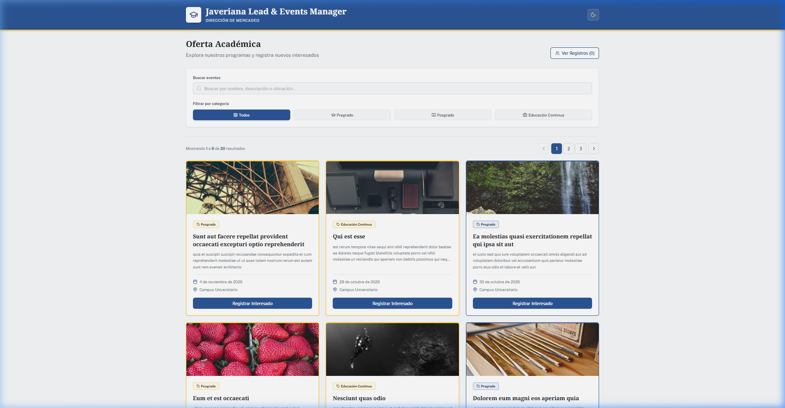
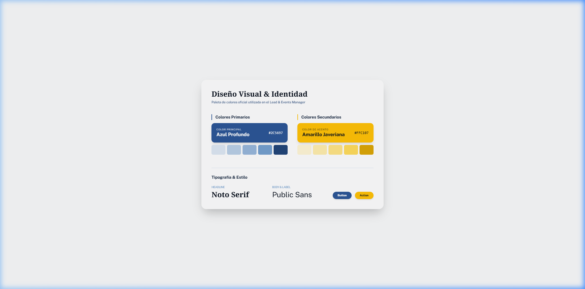
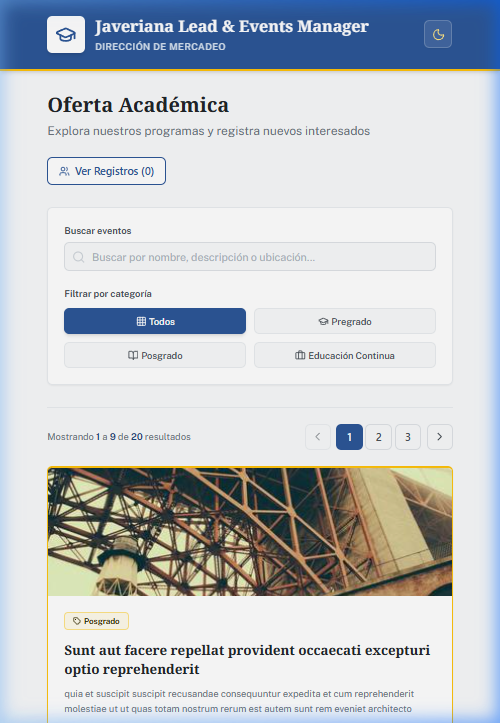

# 🚀 Javeriana Lead & Events Manager

## 📌 Descripción General

Single Page Application (SPA) para la **Pontificia Universidad Javeriana**, diseñada para visualizar la oferta académica y gestionar registros de interesados (leads).


---

## ▶️ Ejecución Local

1. **Clonar el repositorio**:
   ```bash
   git clone https://github.com/Alejool/javeriana-prueba.git
   ```
2. **Navegar al directorio del proyecto**:
   ```bash
   cd javeriana-prueba
   ```
3. **Instalar dependencias**: 
   ```bash
   npm install
   ```
4. **Ejecutar en modo Desarrollo**: 
   ```bash
   npm run dev
   ```
   *La aplicación estará disponible para probar en `http://localhost:5173`*

5. **Construir para Producción** (Opcional): 
   ```bash
   npm run build
   npm run preview
   ```

---

## 🏗️ Decisiones Técnicas

- **Diseño con Stitch**: Se utilizó **Stitch** como herramienta base para idear la interfaz. En este [link del diseño](https://stitch.withgoogle.com/projects/3046567644677806417) se puede ver el enfoque visual y algunas decisiones de UX aplicadas.
- **Estructura por Features**: Organización por módulos (`events`, `leads`) para escalabilidad. Se descartó la estructura básica por tipo para evitar el desorden en proyectos grandes.
- **Manejo de Datos y API**: Como la API (JSONPlaceholder) solo entrega datos básicos de posts, se implementó una **capa de transformación** en los servicios para añadir fechas, tipos de programa y campus de forma aleatoria/estática, enriqueciendo la experiencia.
- **Filtros y Paginación**: Se añadió lógica de filtrado por categoría y búsqueda, además de un sistema de **paginación** para manejar el volumen de datos de forma eficiente.
- **Persistencia de Leads**: Los registros de interesados se gestionan con **Zustand** y se sincronizan automáticamente con `localStorage`, asegurando que los datos no se pierdan al recargar.
- **Gestión de Leads y Validación**: 
  - **Consolidación de Campos**: Se optó por usar un único campo de `Nombre Completo` en lugar de separar nombre y apellido. Esto simplifica la interfaz de usuario (UX) y reduce la carga cognitiva al completar el registro.
  - **Validación de Dominio**: El sistema valida estrictamente que el email pertenezca al dominio institucional `@javeriana.edu.co`.
  - **Inclusión de Campos Básicos**: Aunque no se especificaron campos adicionales en el enunciado, se incluyó el **Teléfono (como opcional)**. Se considera un campo básico necesario en cualquier flujo real de captación de leads para facilitar el contacto posterior por parte de la Dirección de Mercadeo.
  - **Validaciones Detalladas**:
    - **Nombre Completo**: Mínimo 3 caracteres, máximo 100. Solo letras y espacios. Normalización automática (Capitalize).
    - **Email**: Estructura de email válida y dominio obligatorio `@javeriana.edu.co`.
    - **Teléfono**: Opcional. Si se provee, debe tener entre 7 y 15 caracteres y seguir un formato numérico básico.
  - **Normalización Automática**: Los datos se normalizan automáticamente (trimming y capitalización de nombres) utilizando transformaciones de Zod antes de ser persistidos.
- **Arquitectura**: Enfoque modular pragmático. Se consideró Clean Architecture pero se descartó por **sobreingeniería** para el alcance actual.


---

## 🎨 Diseño y UI

🔗 **Diseño en Stitch**: [Academic Excellence Portal](https://stitch.withgoogle.com/projects/3046567644677806417)

### Colores e Identidad
Los colores se tomaron directamente de la **web principal de la Javeriana** para que la prueba sea acorde a su marca:
- **Primary**: `#2C5697` (Azul institucional)
- **Secondary**: `#FFC107` (Amarillo de acento)

### Especificaciones Visuales
- **Bordes**: Se usó predominantemente `rounded-lg` (8px) para un look limpio y profesional. Se evitaron bordes muy redondeados para no perder el tono institucional.
- **Tipografía**: 
  - **Titulares**: Noto Serif (32px / 24px)
  - **Cuerpo/UI**: Public Sans (16px / 14px / 12px)

---

### 📸 Capturas
#### Desktop


#### Paleta


#### Mobile


---

## 🛠️ Stack Tecnológico
Dominio y experiencia en este stack para desarrollo rápido y seguro:
- **React 19 & Vite**: Para un entorno de desarrollo veloz.
- **Tailwind CSS**: Estilizado eficiente sin archivos CSS pesados.
- **Zustand**: Gestión de estado ligera.
- **Zod & React Hook Form**: Validación estricta de formularios.
- **Axios**: Consumo de API con manejo de errores centralizado.

---

Desarrollado con ❤️ para el proceso de selección de la **Pontificia Universidad Javeriana**.


